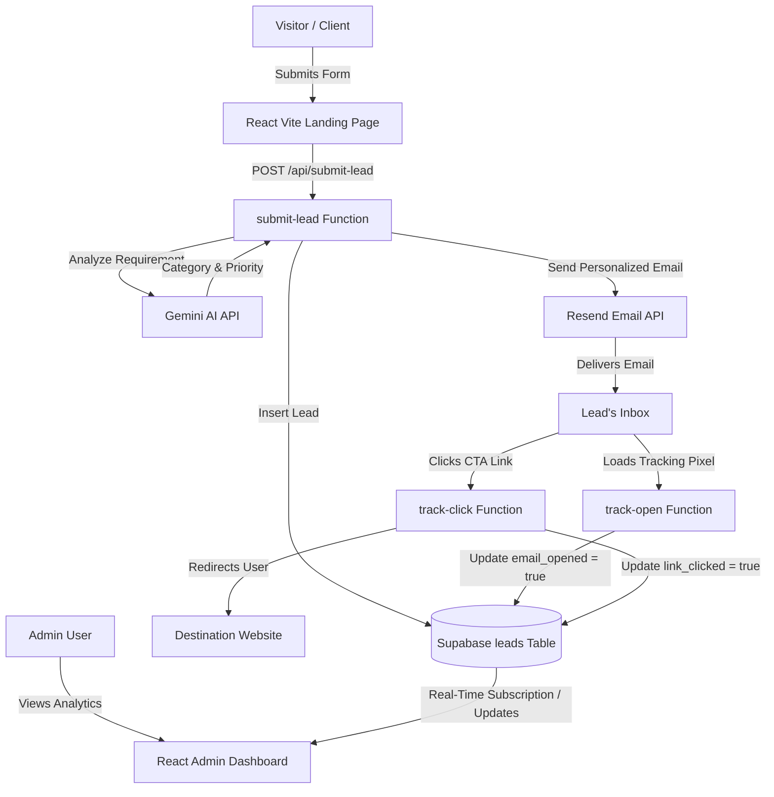

# LeadGenie: Modern Lead Management & Email Tracking System

LeadGenie is a premium, serverless SaaS application for capturing leads, classifying them automatically using Gemini AI, sending personalized follow-ups via Resend, and tracking email interactions (opens and links clicked) in real-time.

Built using **React + Vite + Tailwind CSS** on the frontend, **Supabase** for database telemetry, and **Vercel Serverless Functions** for secure API integrations.

---

## Architecture Diagram



---

## Tech Stack
- **Frontend**: React (Vite), Tailwind CSS (v3), Lucide React (Icons), Canvas Confetti
- **Database**: Supabase
- **Email Delivery**: Resend API
- **AI Engine**: Gemini AI (`gemini-1.5-flash` model via `@google/generative-ai`)
- **Backend / API**: Vercel Serverless Functions (Node.js in `/api/`)
- **Deployment**: Vercel

---

## 1. Database Setup (Supabase)

1. Create a free account at [Supabase](https://supabase.com/).
2. Create a new project.
3. Open the **SQL Editor** in the Supabase Dashboard.
4. Click **New Query** and copy-paste the SQL from [supabase/schema.sql](file:///c:/Users/Mayank/Desktop/LeadGenie/supabase/schema.sql):

```sql
CREATE TABLE IF NOT EXISTS leads (
  id UUID DEFAULT gen_random_uuid() PRIMARY KEY,
  full_name TEXT NOT NULL,
  email TEXT NOT NULL,
  phone TEXT NOT NULL,
  company TEXT,
  requirement TEXT NOT NULL,
  submitted_at TIMESTAMP WITH TIME ZONE DEFAULT timezone('utc'::text, now()) NOT NULL,
  email_sent BOOLEAN DEFAULT false,
  email_opened BOOLEAN DEFAULT false,
  link_clicked BOOLEAN DEFAULT false,
  category TEXT DEFAULT 'Other',
  priority TEXT DEFAULT 'Medium'
);
```

5. Run the query. Your `leads` table is now ready!

---

## 2. API Configurations & Keys

You will need the following API keys:
- **Supabase URL & Anon Key**: Found under Project Settings > API in Supabase.
- **Supabase Service Role Key**: Secret key found under Project Settings > API. *Do not expose this on the frontend.*
- **Resend API Key**: Get a free API key at [Resend](https://resend.com/).
- **Gemini API Key**: Get a free API key at [Google AI Studio](https://aistudio.google.com/).

---

## 3. Local Development Setup

1. Clone or navigate to the project directory:
   ```bash
   cd LeadGenie
   ```

2. Copy the environment variables template:
   ```bash
   cp .env.example .env
   ```

3. Open `.env` and fill in your keys:
   ```env
   VITE_SUPABASE_URL=https://your-supabase-project.supabase.co
   VITE_SUPABASE_ANON_KEY=your_supabase_anon_key
   SUPABASE_SERVICE_ROLE_KEY=your_supabase_service_role_key
   RESEND_API_KEY=re_your_resend_api_key
   GEMINI_API_KEY=your_gemini_api_key
   VITE_ADMIN_PASSPHRASE=admin
   ```

4. Since we use **Vercel Serverless Functions**, the easiest way to run the database-connected backend endpoints and frontend simultaneously is using the **Vercel CLI**:
   - Install Vercel CLI globally: `npm install -g vercel`
   - Start the local dev server:
     ```bash
     vercel dev
     ```
   - Alternatively, to run just the Vite React frontend:
     ```bash
     npm run dev
     ```
     *Note: Serverless API routes under `/api` require `vercel dev` or deployment to run.*

---

## 4. How to Test the Tracking Workflow

1. Go to the landing page (`http://localhost:3000` or whatever port Vercel dev provides).
2. Enter your real email address and submit a message like: *"I need an AI chatbot integrated into my ecommerce website immediately."*
3. Open the **Admin Dashboard** (`/admin`), and log in with the passphrase you set in `.env` (default is `admin`).
4. You will see the lead in the table, with the priority set to **High** and category set to **AI Automation** (automatically determined by Gemini AI).
5. Open your email inbox. You should receive a professionally styled HTML email summary.
6. **Track Open**: The moment you open the email, the tracking pixel will load. Go back to the Admin Dashboard—the lead's **Open** telemetry indicator will turn **Blue** (live without refreshing!).
7. **Track Click**: Click the **Explore Custom Solutions** button in the email. You will hit the tracking redirect endpoint and get redirected back to the homepage. In the Admin Dashboard, the lead's **Click** indicator will immediately turn **Purple**!

---

## 5. Deployment on Vercel

1. Install Vercel CLI (if not already installed): `npm install -g vercel`.
2. Deploy directly:
   ```bash
   vercel
   ```
3. Add the following Environment Variables in your Vercel Project Dashboard:
   - `VITE_SUPABASE_URL`
   - `VITE_SUPABASE_ANON_KEY`
   - `SUPABASE_SERVICE_ROLE_KEY`
   - `RESEND_API_KEY`
   - `GEMINI_API_KEY`
   - `VITE_ADMIN_PASSPHRASE`
4. Re-deploy for production:
   ```bash
   vercel --prod
   ```
5. Your application is live!
